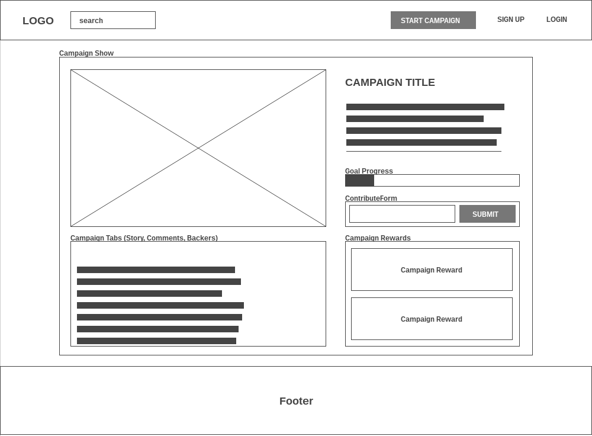

# StartupGoGo

[StartupGoGo live][site]

[site]: http://www.startupgogo.xyz

StartupGoGo is a full-stack web application inspired by IndieGogo.  It utilizes Ruby on Rails on the backend, a PostgreSQL database, and React.js with a Redux architectural framework on the frontend.

## Features & Implementation

### Campaign Rendering and Editing

Startup pitches are stored in a table in the back-end, with columns for each attribute (`user_id`, `title`, `tagline`, etc...).

The home page of the site contains the `CampaignIndex` component, and displays the Startup pitches currently active on the site.

Both the `CampaignIndexItems` on the home page and the individual `CampaignShow` components contain a `GoalProgress` component. This component uses the Pitch's `funds_received` and `goal_amount` attributes from the database to create a dynamic visual representation of the Pitch's progress towards its goal.



Code to create the JSX style attribute for the progress bar in the `GoalProgress` component:

```javascript
const fundsReceived = this.props.fundsReceived;
const goalAmount = this.props.goalAmount;

const style = {
  width: fundsReceived / goalAmount * 100 + "%"
}
```

A Startup Pitch is created using a multi-part form. The user first clicks on the 'Pitch a Startup' button in the header, and enters the desired goal amount and title for the Campaign. This creates a Startup Pitch in the database and sets the `status` attribute to `draft`. The user can then fill in additional information for the Pitch using the `CampaignEditForm` component. When they are ready, they can select 'Review and Publish' to publish the Pitch and make it accessible from the home page.

### Profiles

Each user's details are kept in a table in the database. In addition to the standard user information (`user_id`, `password_digest`, `session_token`, etc...), the `Users` table in the database also contains all of the information pertaining to that user's profile. When the user signs up, they are only required to fill in their first name, last name, email, and password information, however, once successfully logged in, users have access to their profile page, where they can access the `ProfileEdit` component and fill in additional information, such as a profile image and description.

The component content available to a user is dynamically altered based on the current user's status. If a user is not logged in, for example, they will not have access to `ProfileEdit` and `CampaignEdit` components. If a user is logged in and views their own Pitch or Profile, they will have access to the `ProfileEdit` and `CampaignEdit` components as well as a menu bar near the top of the screen allowing them to switch between the 'View' and 'Edit' routes.

What content is available to a user is controlled through dynamically rendering content and using router redirects based on the current user's status.

### Rewards and Contributions

Users can contribute to Startup Pitches from a pitch's `CampaignShow` component. When a user contributes an amount, it will be added to that Pitches `funds_received` attribute in the database, and the `CampaignShow` and `GoalProgress` components will re-render to register the change.

Startup Pitches also have rewards, which can be added, removed, and edited by a user through a pitch's `CampaignEdit` component. When making a contribution, a user can elect to choose one of a Campaign's rewards instead of making a standard contribution. The user contributes an amount equal to that reward's `price` attribute and receives the reward.

The `ProfileShow` component tracks the rewards that users have received. Additionally, the `CampaignShow` component keeps track of which users have backed that Campaign.

## Future Directions for the Project

In addition the the already implemented features, I plan to continue to work on this project and add the additional elements below.

### Search

Searching Startup Pitches would be a very useful element for the app. I will add a search bar to the header that will send an ajax call to the RESTful API based on the user's query. The results would render in a new `CampaignSearchIndex` component with its own route. I will also add lazy loading to the `CampaignSearchIndex` component, along with additional seed data to better demonstrate the feature.

### Loading Animation

I will implement a simple loading animation to improve the app's appearance while loading content.

### Categories

I will also add categories to the app as well. Startup Pitches will have a single category, and users will be able to filter Startup Pitches by category. There will also be a `CategoryIndex` component on the home page that allows users to quickly link to Startup Pitches of a particular category.
